
<h1 align="center">好例文共享平台的设计与实现+jsp</h1>

## 简介
好例文共享平台：角色分为管理员、用户；包含文章展示、评论互动、用户留言、密码修改、文章管理与收藏、留言板管理、用户与数据管理等功能。    --计算机毕业设计源码；毕设源码；java毕业设计源码

## 联系方式

<h3 align="center">获取完整代码与数据库文件 + 微信：deepguan QQ: 86050149 QQ群: 783742310</h3>

<h3 align="center">可帮忙远程部署 包运行成功！提供远程部署、修改代码、设计文档指导、代码讲解等服务！</h3>

## 功能介绍（完整见运行截图）
管理员：基本功能包括登录、注册、退出，以及对个人中心的访问权限，能够管理平台上的所有模块，包括文章管理、用户管理、留言板管理和收藏管理。可以查看、审核和编辑各类文章，并对用户的留言和收藏进行管理。同时，具有创建和管理网站导航、轮播图及基础数据功能，能够对单页内容进行增删改查操作。具备后台管理权限，对用户密码重置、权限分配等安全相关操作进行管理。

用户：基本功能包括登录、注册、退出，以及在个人中心查看和修改个人信息。可以浏览和搜索文章，通过点赞、踩、评论等互动方式进行交流。用户可以管理和查看自己收藏的文章，与其他用户互动，通过留言板提交和查看留言。同时，用户还可以通过设置选项管理自己的文章，编辑或发布新文章，并根据需要修改密码来保障账户安全。享有一定程度的权限来调整浏览和互动偏好，以提升用户体验。

## 运行截图
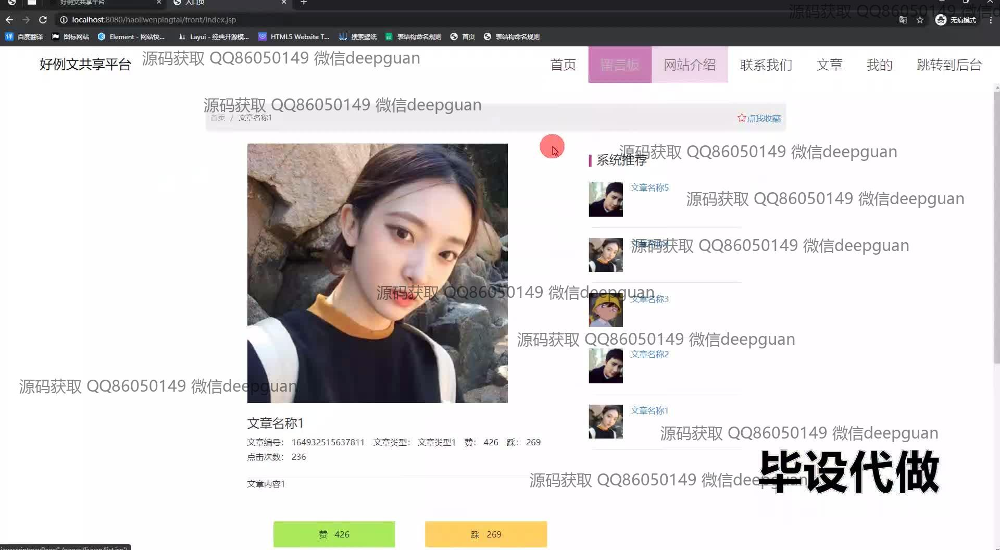
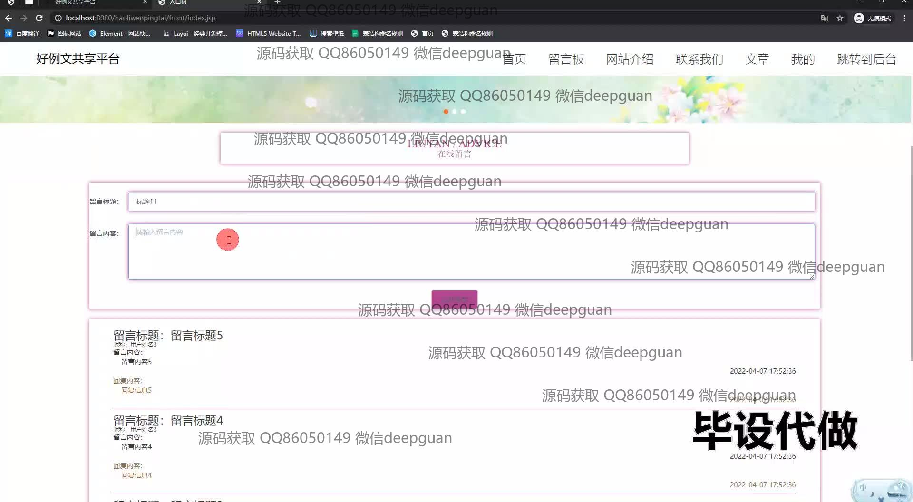
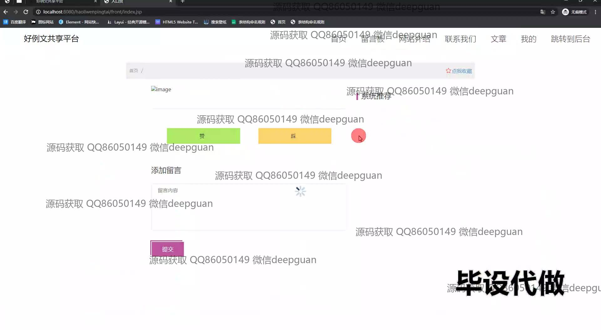
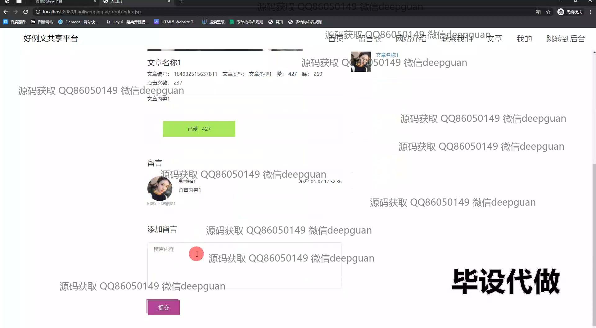
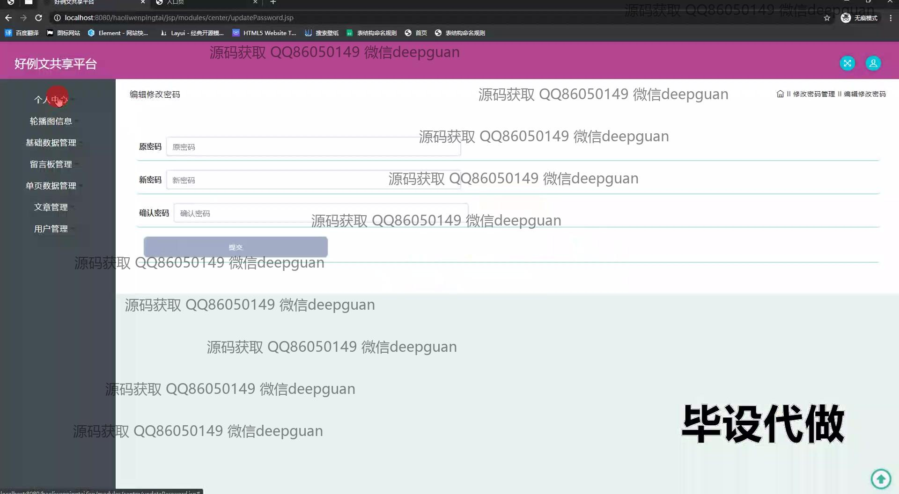
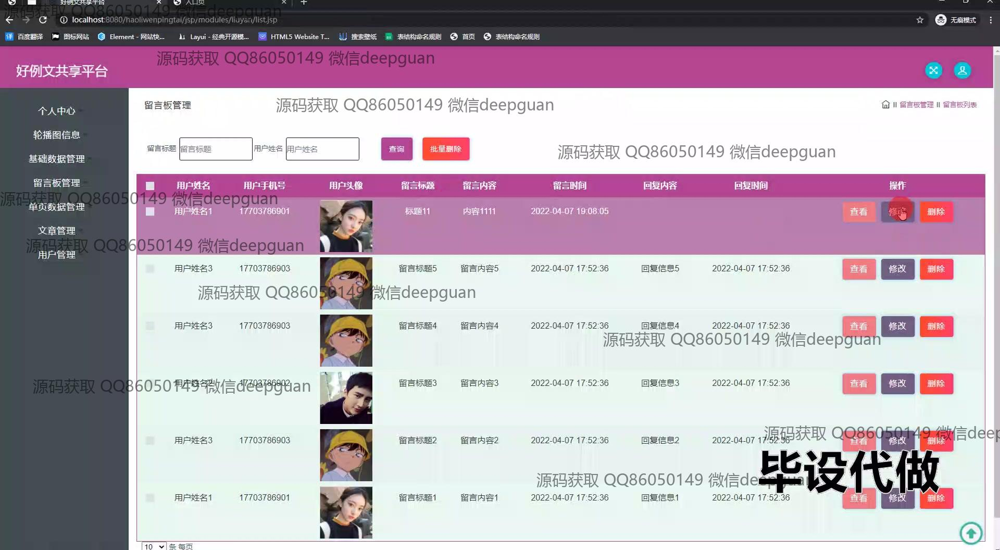
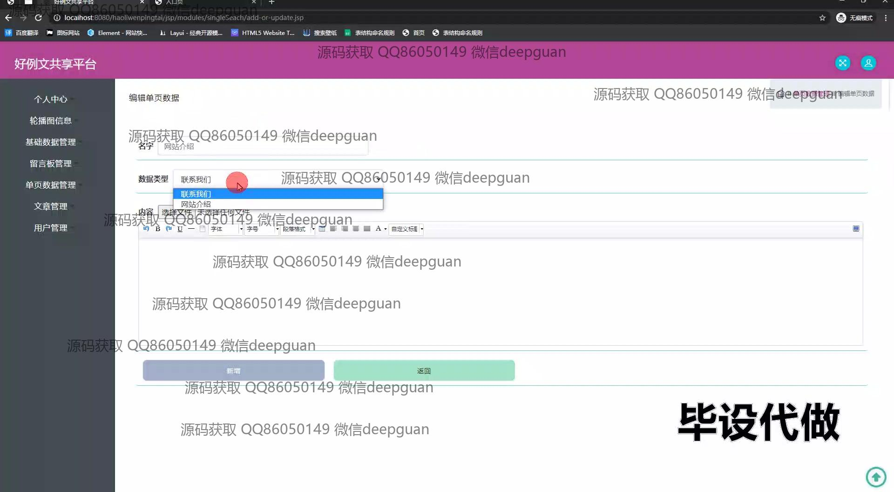
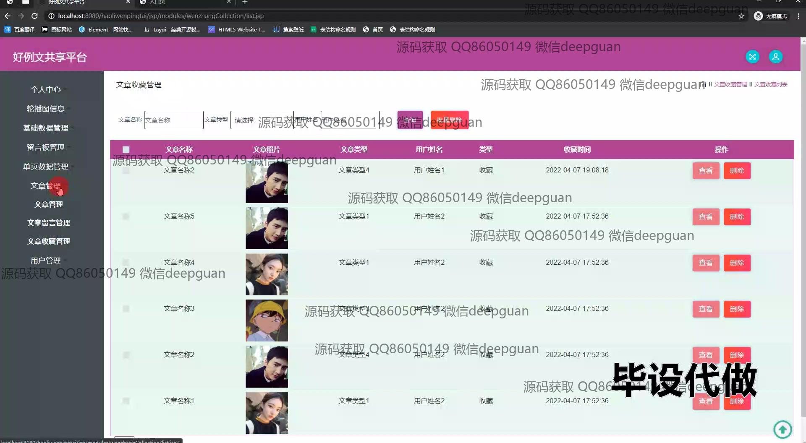
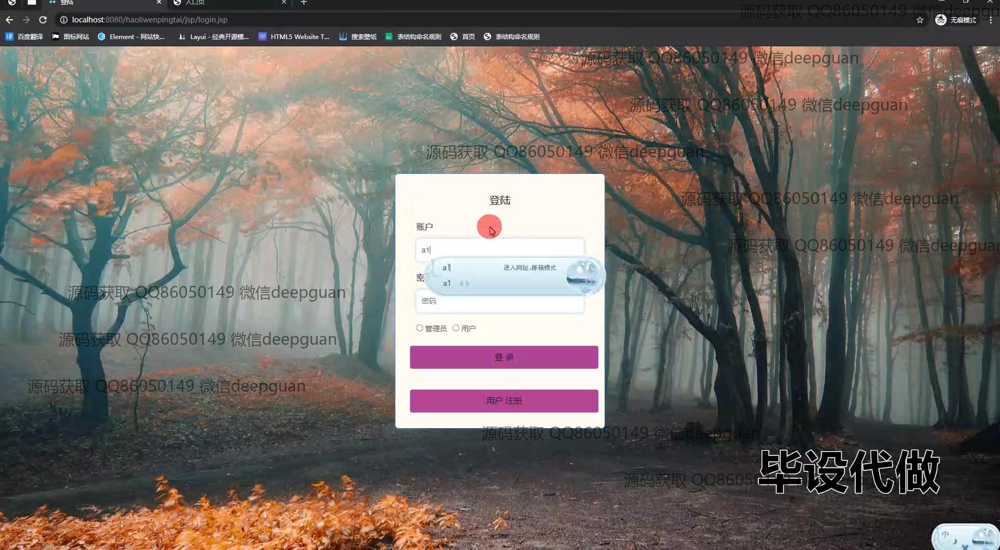
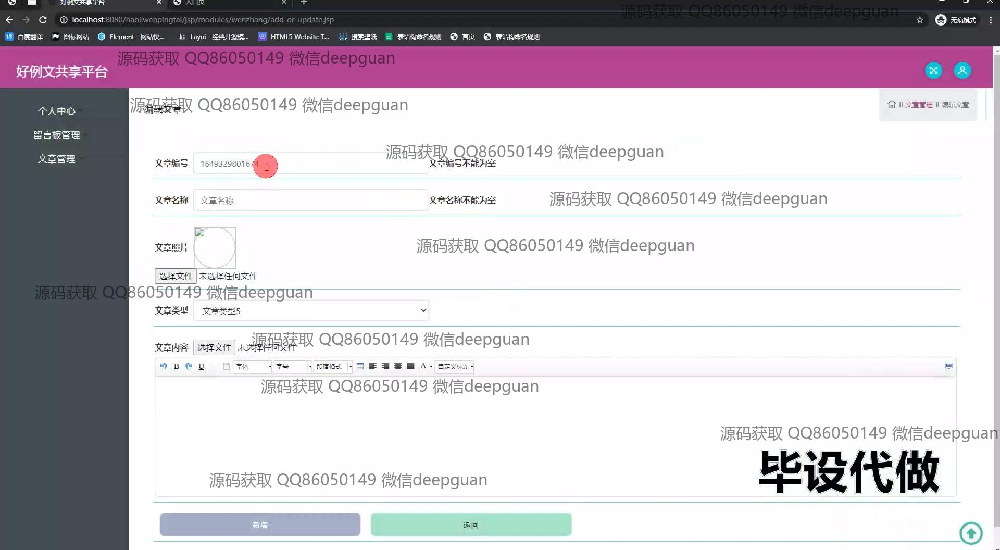
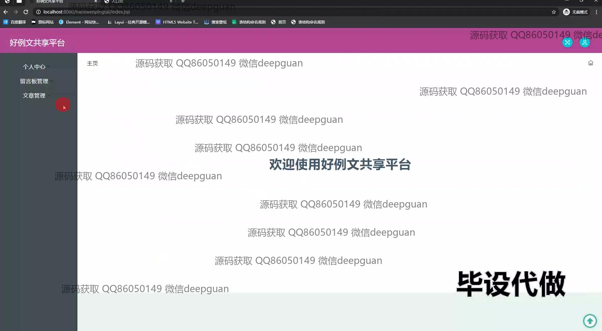
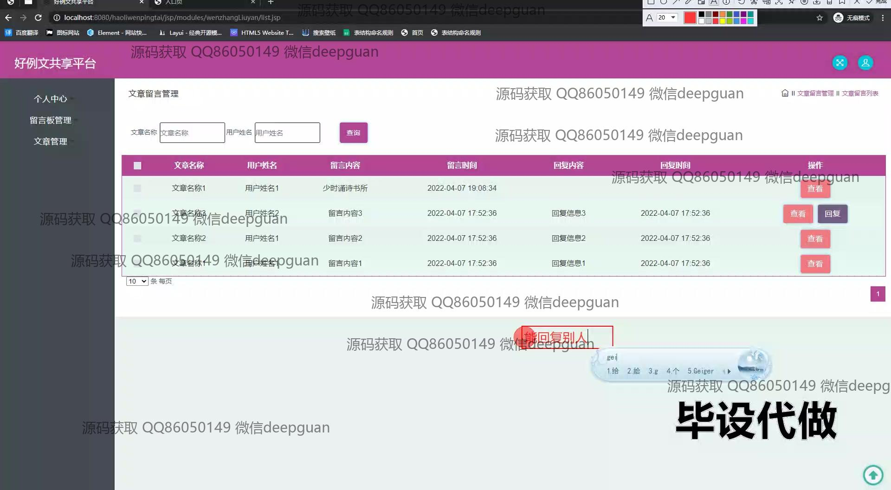

本代码来源于网络,仅供学习参考使用!

